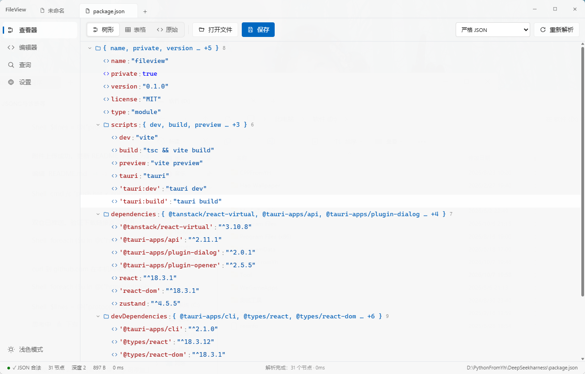

<div align="center">

# FileView

**Windows 11 Fluent 风格的多格式文件查看与编辑器**
**A Fluent-design multi-format file viewer & editor for Windows**


[功能](#-功能) · [界面](#-界面预览) · [格式](#-支持格式) · [下载](#-下载) · [开发](#-开发) · [许可证](#-许可证)

</div>

---

## 简介

FileView 是一款 Windows 桌面应用，用于**查看、解析与编辑** JSON、Markdown、INI 配置、日志和纯文本文件。
打开不同类型的文件会自动切换到对应视图：JSON 有树形 / 表格 / 原始三视图，Markdown 有渲染预览，
INI 有结构化键值视图，日志按级别着色。内置编辑器支持保存（Ctrl+S）、格式化、JSONPath 查询，
并可深度集成 Windows 资源管理器（右键菜单 / 文件关联 / 开机自启）。

> Windows 11 Fluent / WinUI 3 风格界面 · Tauri 2 (Rust) + React 18 + Vite + Tailwind CSS

## 🖼️ 界面预览

<p align="center">
  
</p>

## ✨ 功能

| 模块 | 说明 |
|---|---|
| **多格式视图** | JSON：树形（虚拟滚动）/ 表格（对象数组转表）/ 原始；Markdown：预览 / 源码；INI：结构 / 源码；日志：级别与时间戳着色 |
| **解析诊断** | 行列级错误定位、错误行高亮；严格 JSON / JSONC（注释、尾逗号）/ JSONL（逐行）|
| **查询** | JSONPath（`$.a.b[0]`、`[*]`、`..key`、`['key']`）+ 全文搜索（键/值，点击跳转树节点）|
| **编辑保存** | 编辑器页 / 查看器均可编辑；**Ctrl+S 保存**、另存为、格式化（2/4 空格/Tab）、压缩、键排序 |
| **标签页** | 多标签编辑、脏标记（未保存 •）、空白页可删除、拖拽打开、文件变更自动重载 |
| **系统集成** | 右键菜单「用 FileView 打开」、文件关联与默认应用注册、开机自启、一键清理（注册表无残留）|

## 📄 支持格式

| 类型 | 扩展名 | 视图 |
|---|---|---|
| JSON 家族 | `.json` `.jsonc` `.jsonl` `.ndjson` `.har` `.geojson` | 树形 / 表格 / 原始 |
| Markdown | `.md` `.markdown` | 预览 / 源码 |
| INI 配置 | `.ini` `.cfg` `.conf` | 结构 / 源码 |
| 日志 / 文本 | `.log` `.txt` | 高亮文本 |

## 🖥️ 页面

| 页面 | 说明 |
|---|---|
| 查看器 | 只读展示解析结果（也可直接编辑保存）|
| 编辑器 | 编辑当前文件或空白文档，JSON 附带格式化 / 压缩 / 键排序工具 |
| 查询 | JSONPath 查询与全文搜索 |
| 设置 | 外观、编辑器偏好、Windows 系统集成 |

## 📥 下载

前往 **[Releases](https://github.com/OnlyHiu/FileView/releases)** 获取全部版本，最新版：

| 文件 | 说明 |
|---|---|
| [**FileView_0.1.0_x64-setup.exe**](https://github.com/OnlyHiu/FileView/releases/latest/download/FileView_0.1.0_x64-setup.exe) | NSIS 安装包（推荐，含卸载项）|
| [**fileview.exe**](https://github.com/OnlyHiu/FileView/releases/latest/download/fileview.exe) | 免安装单文件，双击即用 |

> 安装后在设置页勾选扩展名即可注册右键菜单与文件关联。

## 🛠️ 开发

```bash
npm install          # 安装前端依赖
npm run tauri:dev    # 开发模式（Vite + Tauri 窗口）
npm run dev          # 仅浏览器预览（JS 降级解析）
```

测试与打包：

```bash
cd src-tauri && cargo test   # Rust 单元测试（解析/格式化/JSONPath/注册表）
npm run tauri:build          # 打包 exe + NSIS 安装器
```

> 依赖：Node 18+、Rust stable-msvc、VS Build Tools 2022（C++ 工作负载）、WebView2 运行时（Win11 自带）。

## 📁 项目结构

```
├── src/                    # 前端（React + Tailwind）
│   ├── components/ui.tsx   # WinUI 3 风格组件库
│   ├── features/           # 查看器视图、编辑器、查询、设置页
│   ├── stores/             # zustand 状态
│   └── lib/                # Tauri invoke 封装、类型、高亮
├── src-tauri/              # Rust 后端
│   ├── src/json_core/      # 解析 / 格式化 / JSONPath
│   ├── src/sys/            # 注册表、右键菜单、文件关联、自启
│   └── src/main.rs         # Tauri 命令层
├── scripts/gen-icon.mjs    # 程序化生成应用图标
├── push.bat                # 一键推送到仓库
└── docs/DESIGN-PLAN.md     # 设计计划
```

## 🔗 系统集成实现说明

- 全部注册表写入走 **HKCU**（无需管理员）；写入清单记录于 `HKCU\Software\FileView\managed_keys`，
  卸载 /「一键清理」按清单精准回滚，保证无残留。
- 右键菜单：`HKCU\Software\Classes\*\shell\FileView` 等（位于 Windows 11「显示更多选项」经典菜单）。
- 文件关联：注册 ProgID（`HKCU\Software\Classes\FileView.json` 等）+ `OpenWithProgids` +
  Capabilities/RegisteredApplications；**不伪造 UserChoice**（Windows 哈希保护），
  通过 `ms-settings:defaultapps` 引导用户确认默认应用。
- 启动时按设置幂等注入系统集成，并自动迁移/清理旧品牌注册表痕迹。
- 所有变更后调用 `SHChangeNotify(SHCNE_ASSOCCHANGED)` 即时刷新资源管理器。

## 📜 许可证

[MIT](LICENSE) © 2025 FileView Team
